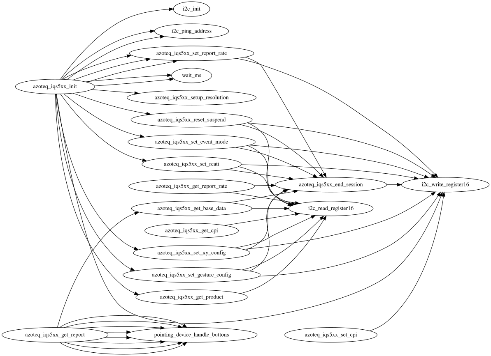

# 🐾 Allie Cat Keeb - Vial-Enabled QMK Firmware for Holykeebs

[](https://github.com/alliecatowo/allie-cat-keeb/tags)
[](https://github.com/alliecatowo/allie-cat-keeb/actions)
[](https://discord.gg/qmk)
[](https://github.com/alliecatowo/allie-cat-keeb/blob/main/LICENSE)

This repository is a **Vial-enabled fork** of the [holykeebs/qmk_firmware](https://github.com/idank/qmk_firmware) repository, bringing modern Vial support to holykeebs' amazing pointing device implementations.

## 🛍️ Get Your Holykeebs Hardware

Visit the **[Holykeebs Store](https://holykeebs.com)** to purchase trackballs, touchpads, trackpoints, and other pointing device modules for your mechanical keyboard!

## 📚 Resources

- **[Holykeebs Documentation](https://docs.holykeebs.com)** - Complete guides for hardware installation and configuration
- **[Holykeebs Repository](https://github.com/idank/qmk_firmware)** - The original holykeebs QMK firmware (branch: `holykeebs-master`)
- **[Vial](https://get.vial.today)** - Real-time keyboard configuration without flashing
- **[Releases](https://github.com/alliecatowo/allie-cat-keeb/releases)** - Pre-built firmware with Vial support

## 🎯 Why This Fork Exists

The holykeebs QMK repository provides excellent support for various pointing devices (trackballs, touchpads, trackpoints) but is based on an older QMK version that lacks modern Vial support. This fork bridges that gap by:

1. **Backporting Vial Components** - We've carefully integrated Vial-QMK components into the holykeebs codebase
2. **Maintaining Compatibility** - All holykeebs pointing device drivers and features remain fully functional
3. **Enabling Real-time Configuration** - Use Vial to customize your keyboard without reflashing firmware
4. **Providing Pre-built Firmware** - Ready-to-use firmware files in our releases section

## 🚀 Key Features

- ✅ **Full Vial Support** - Configure your keyboard in real-time using the Vial GUI
- ✅ **Holykeebs Pointing Devices** - Complete support for:
  - Pimoroni Trackball with RGB
  - Azoteq IQS5xx TPS43 Touchpad
  - PS2 Trackpoint modules
  - Dual pointing device configurations
- ✅ **VIA Compatibility** - Works with both VIA and Vial configurators
- ✅ **Automated Builds** - GitHub Actions automatically build firmware for multiple configurations
- ✅ **Regular Updates** - Synced with upstream holykeebs changes

## 🎹 Supported Keyboards

| Keyboard | Path | Vial Keymap | Notes |
|----------|------|-------------|-------|
| **Lily58 Rev1** | `keyboards/lily58/rev1` | ✅ | Primary target; split, RP2040 |
| **Sofle Rev1** | `keyboards/sofle/rev1` | — | Standard & Keyhive variants |
| **Sofle Keyhive** | `keyboards/sofle/keyhive` | — | RGB variant |
| **Holykeebs Aztec42** | `keyboards/holykeebs/aztec42` | ✅ | Compact 42-key split |
| **Holykeebs SpanKBD** | `keyboards/holykeebs/spankbd` | — | VIA keymap available |
| **Holykeebs Sweeq** | `keyboards/holykeebs/sweeq` | — | VIA keymap available |

Pre-built firmware releases currently target **Lily58 Rev1** (trackball + TPS43). Support for additional keyboards is tracked in the issue list.

## 🔧 What We Changed

To enable Vial support on the holykeebs firmware, we made the following modifications:

### 1. **Vial Core Integration**
- Backported Vial's quantum layer modifications from [vial-qmk](https://github.com/vial-kb/vial-qmk)
- Added Vial-specific keycodes and configuration structures
- Integrated the Vial communication protocol

### 2. **Build System Updates**
- Modified the build system to support Vial's additional features
- Added Vial-specific build flags and configurations
- Created `build.py` — an automated build script for common configurations

### 3. **Keymap Modifications**
- Updated VIA keymaps to include Vial's additional configuration options
- Added proper Vial keyboard definitions (`.vial.json` files)
- Maintained backward compatibility with existing VIA configurations

### 4. **Memory Optimizations**
- Optimized firmware size to accommodate Vial's additional features
- Carefully balanced features to fit within RP2040 constraints

## 📦 Pre-built Firmware

Don't want to build from source? No problem! Check our [Releases](https://github.com/alliecatowo/allie-cat-keeb/releases) page for pre-built firmware files.

Each release includes:
- **Standard builds** - Basic Vial-enabled firmware
- **Debug builds** - With console output for troubleshooting
- **Configuration variants** - Different pointing device combinations

### Firmware Naming Convention:
```
lily58_rev1_vial_[configuration]_[side].uf2
```
- `configuration`: The pointing device setup (e.g., `trackball_tps43`)
- `side`: Either `left` or `right` for split keyboards

## 🛠️ Building Your Own Firmware

### Prerequisites

1. **Fork this repository** (not the base QMK or holykeebs repo)
2. Install QMK dependencies:
   ```bash
   # macOS
   brew install qmk/qmk/qmk

   # Linux/WSL
   sudo apt-get update
   sudo apt-get install -y git python3-pip
   pip3 install qmk
   qmk setup -y
   ```
3. Install Python dependencies:
   ```bash
   python3 -m pip install -r requirements-dev.txt
   ```

### Environment Setup

Before running any build or QMK command, export these variables in your shell:

```bash
export ORIG_CWD="$PWD"
export QMK_HOME="$PWD"
export QMK_FIRMWARE="$PWD"
export PYTHONPATH="$PWD/lib/python"
export PATH="$PWD/bin:$PATH"
```

### Quick Build

```bash
# Clone your fork
git clone --recurse-submodules https://github.com/YOUR_USERNAME/allie-cat-keeb.git
cd allie-cat-keeb

# Build default config (lily58, trackball left + TPS43 right, both sides)
python3 build.py
```

Output `.uf2` files land in `build_lily58/`.

### Build Options

The `build.py` script supports the following actions:

```bash
# Build default config (lily58 trackball_tps43, both sides)
python3 build.py

# Build personal config (same as default, alias)
python3 build.py --build-personal

# Build all configurations
python3 build.py --build-all

# Build a single custom variant
python3 build.py --build-single \
  --keyboard lily58/rev1 \
  --keymap vial \
  --left-device trackball \
  --right-device tps43 \
  --side left

# Build with debug console output
python3 build.py --build-single \
  --keyboard lily58/rev1 \
  --keymap vial \
  --left-device trackball \
  --right-device tps43 \
  --side left \
  --debug

# Generate CI matrix JSON (for GitHub Actions)
python3 build.py --generate-matrix-release
```

Available `--left-device` / `--right-device` values: `trackball`, `tps43`, `trackpoint`, `oled`, `None`.

### Manual Build Commands

For direct QMK make commands:

```bash
# Dual pointing devices with Vial
make lily58/rev1:vial -e USER_NAME=holykeebs \
  -e POINTING_DEVICE=trackball_tps43 \
  -e SIDE=left \
  -e TRACKBALL_RGB_RAINBOW=yes
```

## 🧪 Development & Testing

No ARM toolchain is required for these quick checks:

```bash
# 1. Python unit tests for build.py logic (~5 seconds)
python3 -m unittest tests.test_build_py -v

# 2. Validate CI matrix JSON
python3 build.py --generate-matrix-release

# 3. Lint Python files
flake8 build.py tools/callgraph.py tests/test_build_py.py \
  --max-line-length=120

# 4. QMK CLI smoke tests
python3 -m nose2 -v
```

## 🤖 Codex / Agent Setup

Automating with Codex or bootstrapping a fresh machine? See `AGENTS.md` for the full bootstrap sequence and `docs/codex.md` for additional details.

Key steps:
1. Export the environment variables listed in the **Environment Setup** section above
2. Run `python3 -m pip install -r requirements-dev.txt`
3. Validate with `python3 -m unittest tests.test_build_py -v`

## 🔄 Using GitHub Actions in Your Fork

When you fork this repository, you get automated firmware builds for free!

### Setting Up Actions:
1. Go to your fork's Settings → Actions
2. Enable GitHub Actions if not already enabled
3. The build workflow triggers on:
   - Tags matching `v*` pattern
   - Manual triggers via the GitHub UI (workflow_dispatch)

### Creating a Release:
```bash
# Tag your version
git tag v1.0.0
git push origin v1.0.0
```

The workflow will automatically:
- Build all firmware variants
- Create a GitHub release
- Attach the firmware files

## 🤝 Contributing

We welcome contributions! Whether you want to:
- Add support for new pointing devices or keyboards
- Improve Vial integration
- Fix bugs or optimize code
- Improve documentation

### How to Contribute:
1. Fork this repository
2. Create a feature branch (`git checkout -b feature/amazing-feature`)
3. Commit your changes using [conventional commits](https://www.conventionalcommits.org/) (`feat:`, `fix:`, `docs:`, `chore:`, etc.)
4. Push to your branch and open a Pull Request

### Testing Your Changes:
- Run `python3 -m unittest tests.test_build_py -v` before committing
- Build and test firmware locally if an ARM toolchain is available
- Include before/after comparisons for significant changes
- Document any new features or configurations

See `CONTRIBUTING.md` for the full guide.

## 🎮 Getting Your Keyboard Working

### 1. Flash the Firmware
1. Download the appropriate `.uf2` file from [Releases](https://github.com/alliecatowo/allie-cat-keeb/releases)
2. Enter bootloader mode (double-tap RESET)
3. Copy the `.uf2` file to the `RPI-RP2` drive
4. Repeat for both halves (if split keyboard)

### 2. Configure with Vial
1. Download [Vial](https://get.vial.today)
2. Connect your keyboard
3. Customize everything in real-time:
   - Key mappings and layers
   - Macros
   - Pointing device settings
   - RGB lighting

## 🚨 Troubleshooting

### Common Issues:

**"Vial doesn't detect my keyboard"**
- Ensure you flashed the Vial-enabled firmware (not base holykeebs)
- Try a different USB cable or port
- Check that both halves are flashed (for split keyboards)

**"Pointing device not working"**
- Verify the correct firmware variant for your hardware
- Check wiring connections (see [docs.holykeebs.com](https://docs.holykeebs.com))
- Try the debug firmware build for console output (`--debug` flag)

**"Build fails"**
- Make sure you're building from this fork, not base QMK
- Export the environment variables from the **Environment Setup** section
- Run `qmk doctor` to check your environment
- Ensure submodules are initialized: `git submodule update --init`

## 📊 Driver Call Graph

The Azoteq IQS5xx touchpad driver call graph is generated automatically during
the CI workflow. You can view the latest graph below:



## 📈 Project Status

This project is actively maintained and regularly synced with upstream holykeebs changes. We aim to:
- Keep Vial support up-to-date
- Maintain compatibility with all holykeebs hardware
- Provide timely firmware releases
- Support the community

## 🙏 Acknowledgments

- **[idank](https://github.com/idank)** - Creator of the holykeebs firmware and hardware
- **[Vial Contributors](https://github.com/vial-kb/vial-qmk)** - For the amazing real-time configuration system
- **[QMK Community](https://qmk.fm)** - For the incredible keyboard firmware framework
- **All Contributors** - Who help make this project better

## 📄 License

This firmware is based on QMK and includes modifications from holykeebs and Vial. Licensed under GPL-2.0+ with the same terms as QMK firmware.

---

<div align="center">

**[Get Hardware](https://holykeebs.com)** • **[Documentation](https://docs.holykeebs.com)** • **[Releases](https://github.com/alliecatowo/allie-cat-keeb/releases)** • **[Report Bug](https://github.com/alliecatowo/allie-cat-keeb/issues)**

Made with ❤️ for the mechanical keyboard community

</div>
